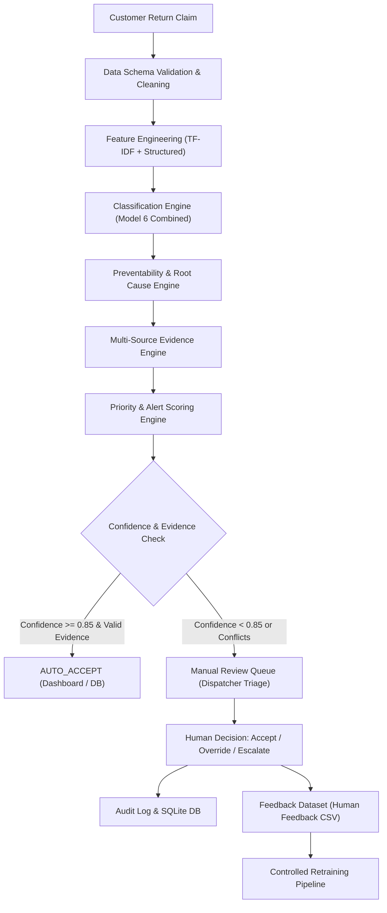

# Architecture Diagram — RETURN INSIGHT

```mermaid
flowchart TD
    A["Customer Return Claim"] --> B["Data Schema Validation & Cleaning"]
    B --> C["Feature Engineering (TF-IDF + Structured)"]
    C --> D["Classification Engine (Model 6 Combined)"]
    D --> E["Preventability & Root Cause Engine"]
    E --> F["Multi-Source Evidence Engine"]
    F --> G["Priority & Alert Scoring Engine"]
    G --> H{"Confidence & Evidence Check"}
    H -- "Confidence >= 0.85 & Valid Evidence" --> I["AUTO_ACCEPT (Dashboard / DB)"]
    H -- "Confidence < 0.85 or Conflicts" --> J["Manual Review Queue (Dispatcher Triage)"]
    J --> K["Human Decision: Accept / Override / Escalate"]
    K --> L["Audit Log & SQLite DB"]
    K --> M["Feedback Dataset (Human Feedback CSV)"]
    M --> N["Controlled Retraining Pipeline"]
```
